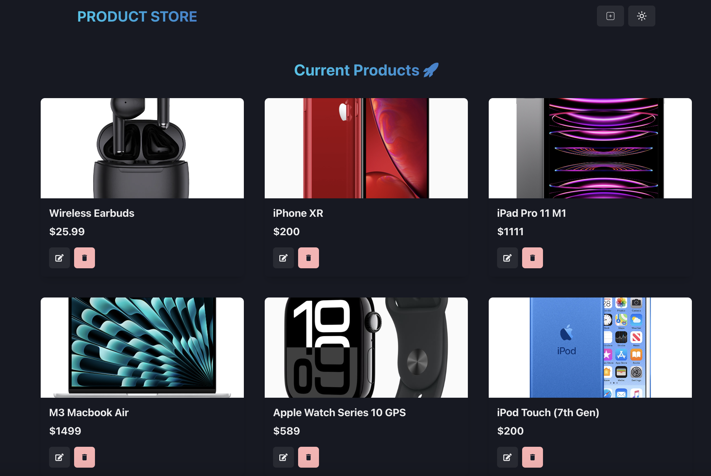
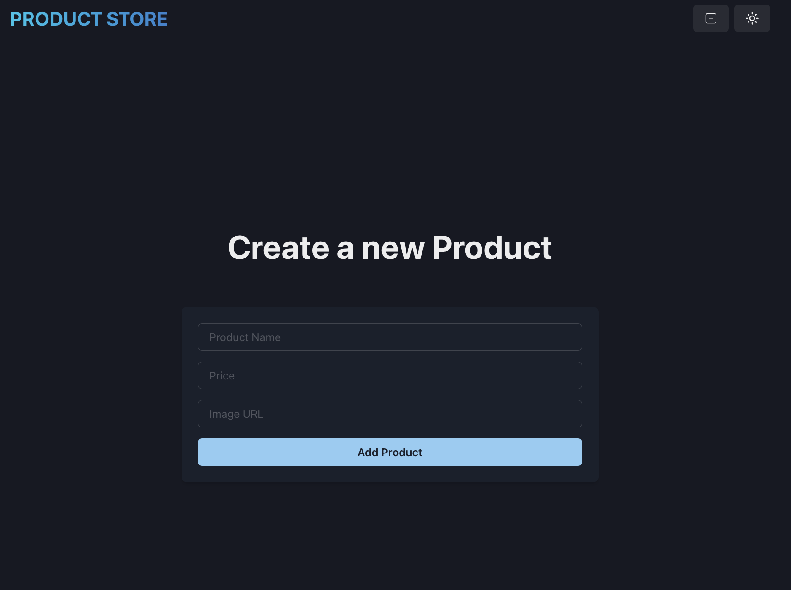
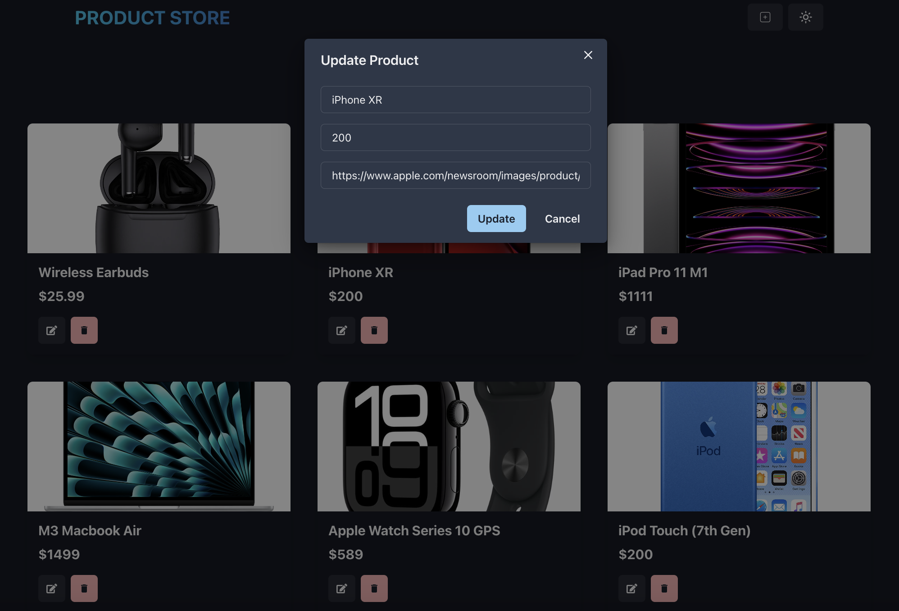

# 🛍️ Product Store

## Description

This full stack application is built using the MERN stack (MongoDB, express, React, Node). It allows the user to add a new product into the store (including the product name, price, and image), edit these details as well as delete the product from the storefront. The user is notified of the success or failure of actions performed during adding, editing or deleting products via a toast. The UI was built with ChakraUI.

